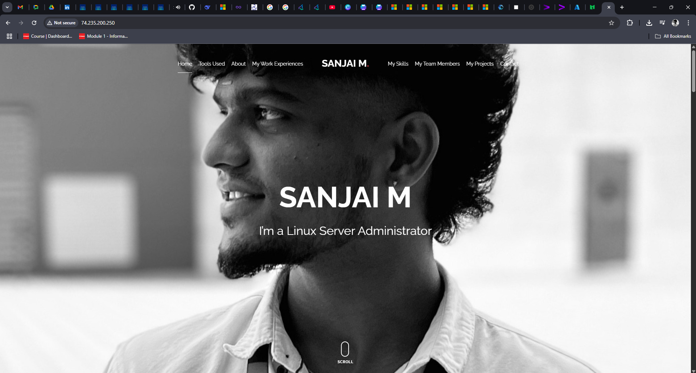

# 🌐 Personal Portfolio Deployment on Azure using Terraform

This project demonstrates how to deploy a personal portfolio website on Microsoft Azure using Terraform (Infrastructure as Code), Docker, and Nginx. It showcases skills in cloud infrastructure, automation, and Linux server management.

---

## 🚀 Project Overview

- Provisioned a Virtual Machine on Azure using Terraform
- Installed Docker and containerized the personal portfolio
- Configured Nginx as a reverse proxy to serve the website
- Planned CI/CD integration using GitHub Actions (coming soon)

---

## 📦 Tech Stack

| Tool        | Purpose                               |
|-------------|----------------------------------------|
| **Azure**   | Cloud infrastructure provider          |
| **Terraform** | Infrastructure provisioning (IaC)     |
| **Docker**  | Containerization of portfolio app      |
| **Nginx**   | Web server & reverse proxy             |
| **Linux (Ubuntu)** | Base OS on Azure VM             |
| **GitHub**  | Source code management & version control |
| **GitHub Actions** | (To be added) CI/CD pipeline    |

---

## 📁 Folder Structure

.
├── main.tf # Terraform main configuration
├── variables.tf # Terraform variables
├── outputs.tf # Terraform outputs
├── portfolio/ # Portfolio website source code
│ └── Dockerfile # Docker config for portfolio
└── README.md # This file

---

## 🚀 Project Output Screenshot

